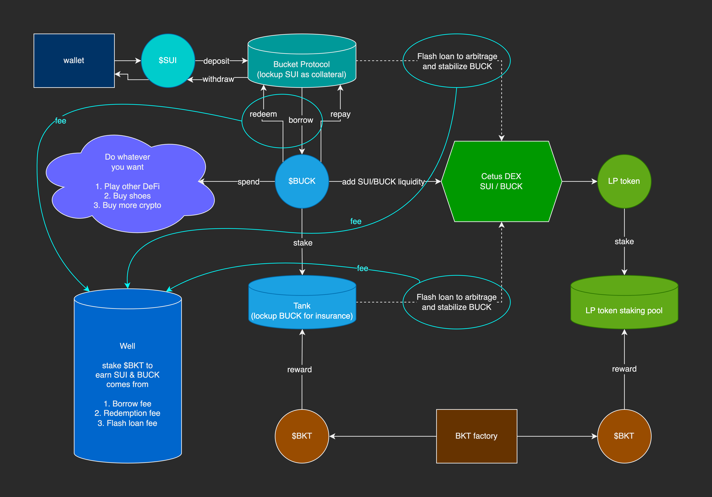

# Bucket Protocol
Zero-interest lending protocol on Sui, borrowing stablecoin against $SUI.

## Mechanism
1. Deposit $SUI as collateral and borrow $BUCK with minimal collateral ratio 110%
2. Repay with $BUCK and take back collateral $SUI
3. Redeem $BUCK from protocol to get 1:1 value of $SUI
4. Deposit $BUCK to Tank to earn incentive token $BKT
5. Provide liquidity for SUI/BUCK on DEX also earn $BKT
6. Stake $BKT to share protocol revenue, coming from Borrow Fee, Redemption Fee and Flash Loan Fee
 
## Flow chart

